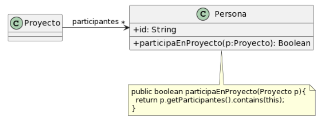
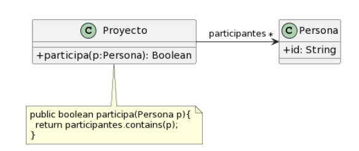

### Ejercicio 1: Algo huele mal
Indique qué malos olores se presentan en los siguientes ejemplos.	


### 1.1 Protocolo de Cliente
La clase Cliente tiene el siguiente protocolo. ¿Cómo puede mejorarlo? 

```java
/** 
* Retorna el límite de crédito del cliente
*/
public double lmtCrdt() {...

/** 
* Retorna el monto facturado al cliente desde la fecha f1 a la fecha f2
*/
protected double mtFcE(LocalDate f1, LocalDate f2) {...

/** 
* Retorna el monto cobrado al cliente desde la fecha f1 a la fecha f2
*/
private double mtCbE(LocalDate f1, LocalDate f2) {...
```
					
```
#### Bad Smell: Nombre de los metodos
#### Refactoring: Rename Method
```
```java
/** 
* Retorna el límite de crédito del cliente
*/
public double limiteDeCredito() {...

/** 
* Retorna el monto facturado al cliente desde la fecha f1 a la fecha f2
*/
protected double montoFacturado(LocalDate f1, LocalDate f2) {...

/** 
* Retorna el monto cobrado al cliente desde la fecha f1 a la fecha f2
*/
private double montoCobrado(LocalDate f1, LocalDate f2) {...
```

### 1.2 Participación en proyectos 

```
Al revisar el siguiente diseño inicial (Figura 1), se decidió realizar un cambio para evitar lo que se consideraba un mal olor. El diseño modificado se muestra en la Figura 2. Indique qué tipo de cambio se realizó y si lo considera apropiado. Justifique su respuesta.

Diseño inicial:


Diseño revisado:


Se realizo un Move Method, se ambio la coleccion de participantes que estaba en la clase Persona, se movio a la clase Proyecto. 
Se producia el Bad Smeell, envidia de atributos. Ya que le corresponde a la clase proyecto verificar en la coleccion si x persona esta.
```


### 1.3 Cálculos 
Analice el código que se muestra a continuación. Indique qué code smells encuentra y cómo pueden corregirse.

```java		
public void imprimirValores() {
	int totalEdades = 0;
	double promedioEdades = 0;
	double totalSalarios = 0;
	
	for (Empleado empleado : personal) {
		totalEdades = totalEdades + empleado.getEdad();
		totalSalarios = totalSalarios + empleado.getSalario();
	}
	promedioEdades = totalEdades / personal.size();
		
	String message = String.format("El promedio de las edades es %s y el total de salarios es %s", promedioEdades, totalSalarios);
	
	System.out.println(message);
}
```
```
Bad Smell Generales: Long Method / Reinventar la rueda / Temporary field 
Refactoring Generales: Extract Method/ Replace loop whit pipeline 
```
```
Bad Semell: Long Method.
Refactoring: Extract Method, elimino el string message, para reemplazarlo por un return
```

```java
public void imprimirValores() {
	int totalEdades = 0;
	double promedioEdades = 0;
    double totalSalarios = 0;
	
	for (Empleado empleado : personal) {
		totalEdades = totalEdades + empleado.getEdad();
		totalSalarios = totalSalarios + empleado.getSalario();
	}
	promedioEdades = totalEdades / personal.size();
	
	return promedioEdades;
}
```
```
Bad Semell: Reinventar la rueda.
Refactoring: Replace loop whit pipeline , utlizo streams para realizar los metodos.
```
```java
public void imprimirValores() {
    int totalEdades = personal.stream()
                            .maptoInt(Empleado::getEdad())
                            .sum();

	double promedioEdades = personal.stream()
                            .maptoInt(Empleado::getEdad())
                            .average()
                            .orElse(0);

    double totalSalarios = personal.stream()
                            .maptoInt(Empleado::getSalario())
                            .sum();
	
	promedioEdades = totalEdades / personal.size();
	
	return promedioEdades;
}
```	
```
Bad Semell: Long Method.
Refactoring: Extract Method, para que todos sean funciones independientes.
```
```java
public void totalEdades() {
    int totalEdades = personal.stream()
                            .maptoInt(Empleado::getEdad())
                            .sum();
    return totalEdades;
}

public void promedioEdades() {
    double totalEdades = personal.stream()
                            .maptoInt(Empleado::getEdad())
                            .average()
                            .orElse(0);
    return promedioEdades;
}

public void totalSalarios() {
    int totalEdades = personal.stream()
                            .maptoInt(Empleado::getSalario())
                            .sum();
    return totalSalarios;
}

```


